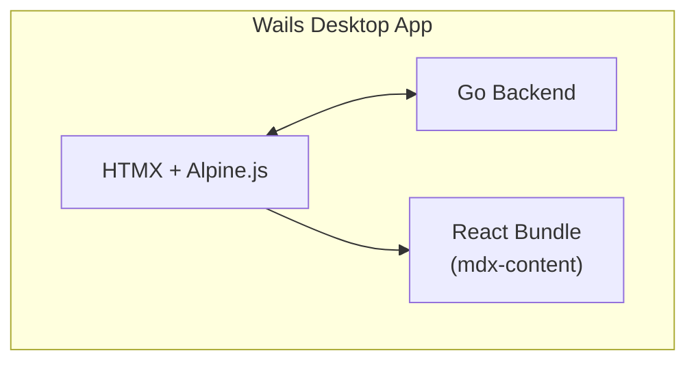

# Editor — Application Documentation

## Modules

| Module | Description | Status |
|--------|-------------|--------|
| **Vault** | File management, CRUD, file tree, watcher | P0 |
| **Editor** | CodeMirror 6 markdown editing | P0 |
| **Preview** | @docubook/mdx-content render | P0 |
| **Wiki** | Wikilinks, backlinks, unlinked mentions | P1 |
| **Tags** | Tag system, tag pane, filter | P1 |
| **Search** | Full-text search (bleve) | P1 |
| **Graph** | D3.js note graph visualization | P2 |
| **AI Agent** | AI inline assistant (SSE) | P2 |
| **Config** | docu.json editor | P0 |
| **Git** | Git push trigger | P0 |

## Architecture

## Tech Stack
- **Desktop:** Wails v2 (Go + WebView)
- **Backend:** Go (chi, goldmark, fsnotify, bleve)
- **Frontend:** HTMX + Alpine.js + CodeMirror 6 + Tailwind v4
- **Preview:** React + @docubook/mdx-content
- **Build/Deploy:** CI Cloud (Git push → flame build)
