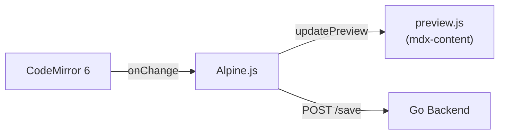

# Module: Editor

## Description
Markdown editor core — CodeMirror 6 untuk editing + preview via mdx-content.

## Features
| Feature | Priority | Status | Sprint |
|---------|----------|--------|--------|
| CodeMirror 6 markdown editing | P0 | ✅ | S1 |
| Syntax highlighting | P0 | ✅ | S1 |
| Tab bar + file switching | P0 | ✅ | S1 |
| Split pane (edit + preview) | P0 | ✅ | S2 |
| Command palette (Ctrl+P) | P1 | ✅ | S1 |
| WYSIWYG toggle | P1 | ⏳ | future |
| Vim/Emacs keybindings | P2 | ⏳ | future |

## Architecture

## Dependencies
- CodeMirror 6 (npm)
- @docubook/mdx-content (preview bundle)
- goldmark (Go, quick parse)
