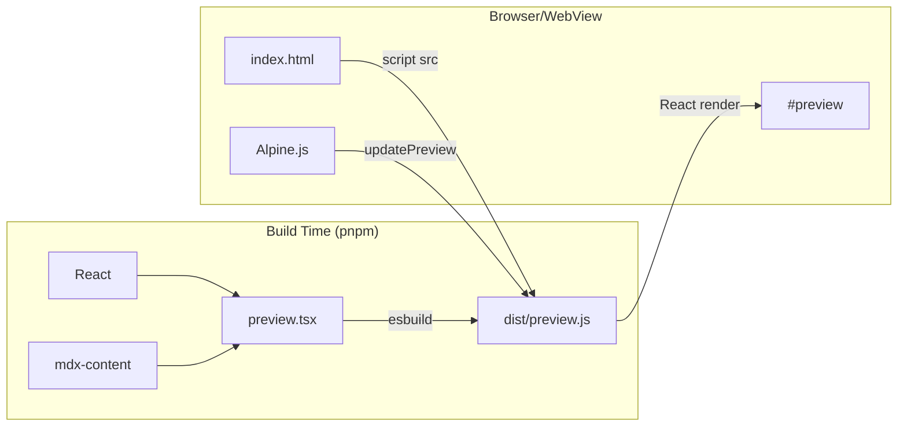

# Module: Preview

## Description
Preview render — standalone React bundle yang merender @docubook/mdx-content komponen. Output identik dengan final DocuBook build.

## Features
| Feature | Priority | Status | Sprint |
|---------|----------|--------|--------|
| Render markdown → identik final | P0 | ✅ | S2 |
| Mermaid diagrams (via mermaid lib) | P0 | ✅ | S2 |
| CodeBlock dengan syntax highlight | P0 | ✅ | S2 |
| Tabs, Accordion (mdx-content) | P0 | ✅ | S2 |
| Note, Card, Stepper (mdx-content) | P0 | ✅ | S2 |
| MDX compile (via @mdx-js/mdx) | P0 | ✅ | S2 |
| Link, Image, Youtube (mdx-content) | P0 | ✅ | S2 |

## Architecture


## Build
```bash
cd frontend && node build-preview.cjs  # → public/preview.js
```
Output otomatis di-copy ke `dist/` oleh Vite saat `npm run build`.

> Catatan: esbuild terpisah dari Vite karena @mdx-js/mdx punya Node.js subpath imports (#minpath) yang tidak bisa di-resolve oleh Rollup.

## Dependencies
- @docubook/mdx-content (React components)
- @mdx-js/mdx (compile MDX → JSX)
- React + React DOM
- mermaid (diagram rendering)
- esbuild (bundler)
