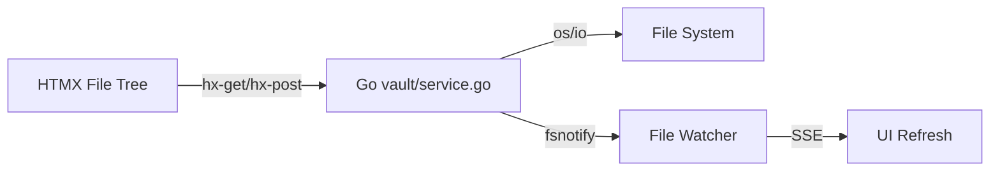

# Module: Vault

## Description
File management system — open folder sebagai vault, CRUD file/folder, file tree sidebar, file watcher.

## Features
| Feature | Priority | Status | Sprint |
|---------|----------|--------|--------|
| Open folder sebagai vault | P0 | ✅ | S3 |
| File tree (HTMX recursive) | P0 | ✅ | S3 |
| Create/rename/delete file/folder | P0 | ✅ | S3 |
| File content load + save | P0 | ✅ | S3 |
| Goldmark parser (headings, wordcount) | P0 | ✅ | S3 |
| Drag & drop | P1 | ⏳ | future |
| File watcher (fsnotify) | P2 | ⏳ | S7 |

## Architecture

## API Endpoints
| Method | Path | Description | Status |
|--------|------|-------------|--------|
| GET | /api/vault/tree | File tree HTML (HTMX fragment) | ✅ |
| GET | /api/vault/tree/{path} | Subfolder tree | ✅ |
| POST | /api/vault/open | Open vault | ✅ |
| GET | /api/vault/file/{path} | Read file + metadata | ✅ |
| POST | /api/vault/file | Create file | ✅ |
| POST | /api/vault/rename | Rename file/folder | ✅ |
| POST | /api/vault/delete | Delete file/folder | ✅ |
| POST | /api/vault/mkdir | Create folder | ✅ |
| POST | /api/vault/save | Save file content | ✅ |

## Dependencies
- fsnotify (Go)
- chi (Go, routing)
