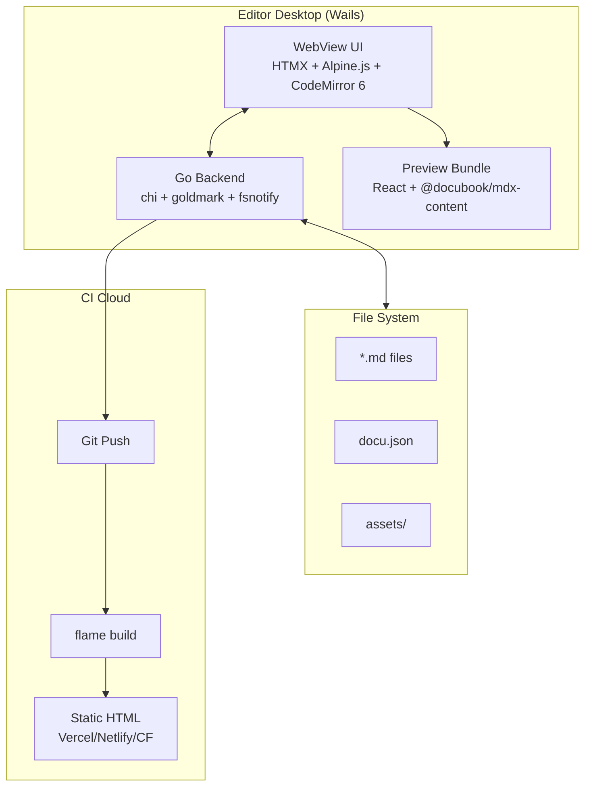
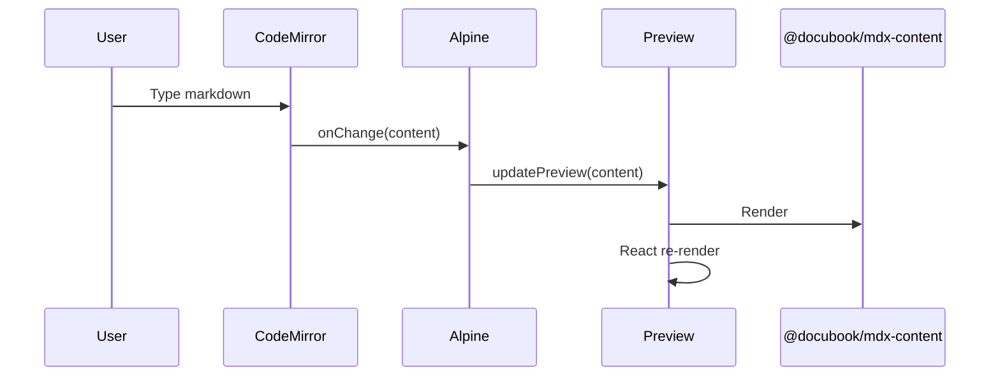
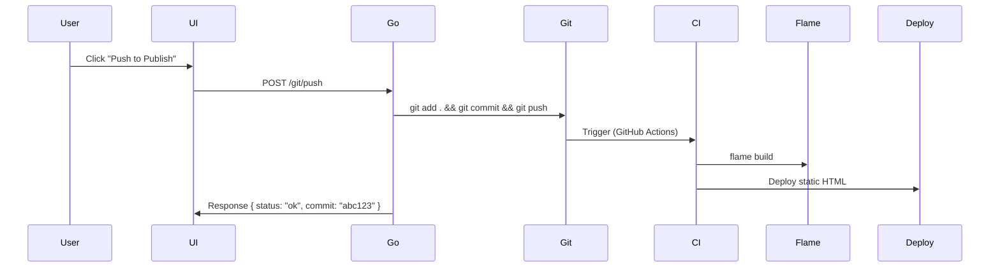

# Architecture Design — Editor

## System Architecture



## Component Map

### Go Backend (internal/)

| Package | Responsibility | Key Library | Status |
|---------|---------------|-------------|--------|
| `vault/service.go` | CRUD file/folder, vault state | os, io/fs | ✅ S3 |
| `vault/watch.go` | File system watcher | fsnotify | ⏳ S7 |
| `vault/search.go` | Full-text search index | bleve | ⏳ S6 |
| `markdown/parser.go` | Parse markdown → outline, backlinks, tags | goldmark | ✅ S3 |
| `git/push.go` | git add + commit + push | os/exec | ⏳ S4 |
| `config/dotu.go` | Read/write docu.json | encoding/json | ⏳ S4 |
| `agent/provider.go` | AI provider interface | net/http | ✅ S8 |
| `agent/openai.go` | OpenAI (+ OpenAPI-compatible) | — | ✅ S8 |
| `agent/anthropic.go` | Anthropic Claude | — | ✅ S8 |
| `agent/service.go` | AI orchestrator | — | ✅ S8 |
| `server/router.go` | HTTP router + HTMX endpoints | chi | ✅ S1 |

### Frontend (frontend/)

| Komponen | Teknologi | Urusan | Status |
|----------|-----------|--------|--------|
| index.html | HTMX + Alpine.js | Entry + chrome UI | ✅ |
| src/main.js | Alpine.js | App state, tabs, palette, preview bridge | ✅ S1 |
| src/editor.js | CodeMirror 6 | Markdown editor | ✅ S1 |
| src/style.css | CSS | Zed theme (dark/light) | ✅ S1 |
| preview/preview.tsx | React + mdx-content | Preview render (esbuild standalone) | ✅ S2 |
| public/preview.js | esbuild output | Preview bundle (~10MB) | ✅ S2 |
| file-tree.js | Alpine.js | File tree sidebar | ✅ (inline di router.go + main.js) |
| status-bar.js | Alpine.js | Git branch, cursor pos | ✅ (inline HTMX) |
| graph.js (P2) | D3.js | Note graph visualization | ⏳ S7 |

### Preview Bundle (frontend/preview/)

```
@docubook/mdx-content (React components)
    ↓
preview.tsx → Wrapper render(markdown) → HTML
    ↓
esbuild → frontend/public/preview.js (standalone, ~10MB)
    ↓
Loaded via <script> di HTMX page → React mount di #preview
```

> Catatan: esbuild terpisah dari Vite karena @mdx-js/mdx punya subpath imports (#minpath, dll) yang tidak bisa di-resolve oleh Rollup/Vite. Build via `frontend/build-preview.cjs`, output otomatis di-copy ke dist oleh Vite.

## Data Flow — Edit → Preview



## Data Flow — Git Push



## Key Design Decisions

| Decision | Choice | Rationale |
|----------|--------|-----------|
| Desktop shell | Wails v2 | Go native, ~10MB, macOS 10+, arm64 + x64 |
| Frontend pattern | HTMX + Alpine.js | Minimal JS, server-driven |
| Editor | CodeMirror 6 | Mature, extensible, standalone |
| Preview render | React bundle | Reuse @docubook/mdx-content, output identik |
| Search engine | Bleve | Pure Go, full-text, zero deps |
| Markdown parser | Goldmark | CommonMark + GFM, Go native |
| Build system | CI Cloud | Base image, deps, git di cloud |
