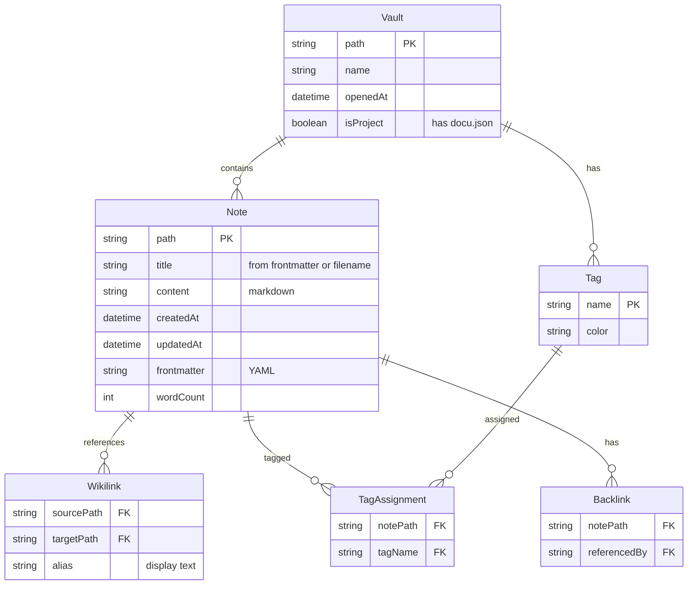
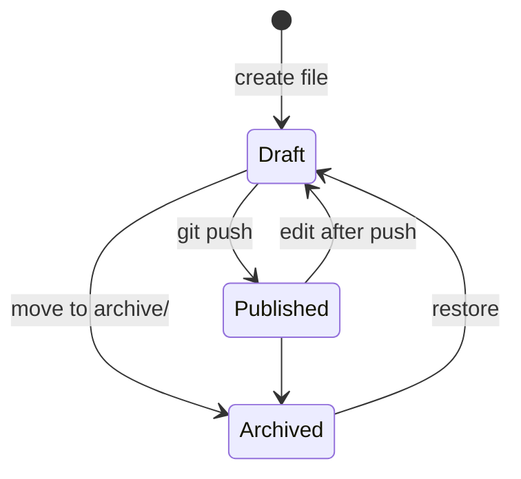

# Domain Model — Editor

## Entities

### Vault
Root directory yang berisi file markdown. Bisa pribadi (tanpa docu.json) atau project (ada docu.json).

### Note
Satu file markdown (.md) di dalam vault. Punya frontmatter YAML opsional, konten markdown, dan metadata.

### Tag
Label yang bisa ditempel ke note — inline `#tag` atau di frontmatter `tags: [tag1, tag2]`.

### Wikilink
Referensi `[[Note Title]]` dari satu note ke note lain. Autocomplete saat ngetik `[[`.

### Backlink
Link balik — note mana saja yang me-refer ke note ini.

## State Machine — Note

