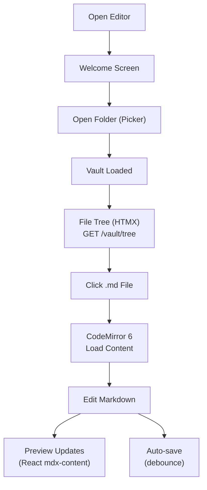
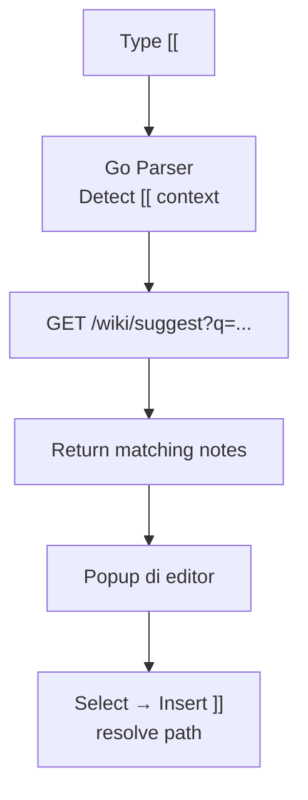
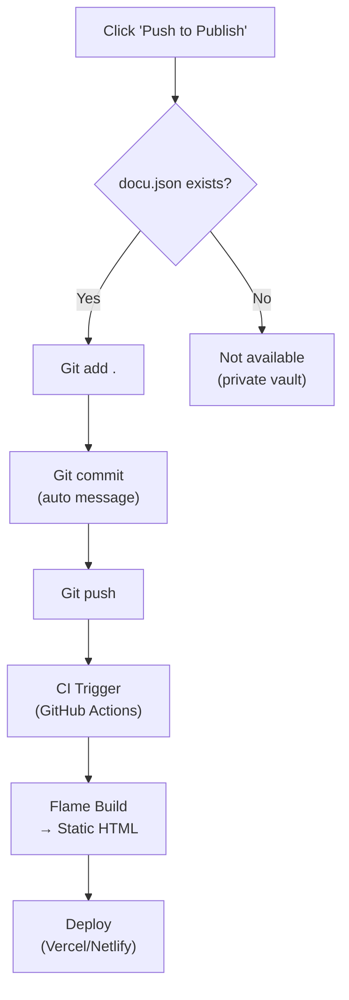
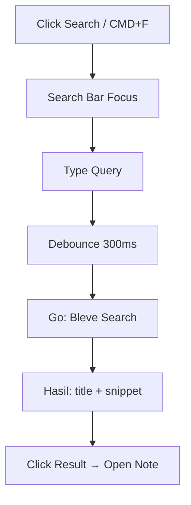
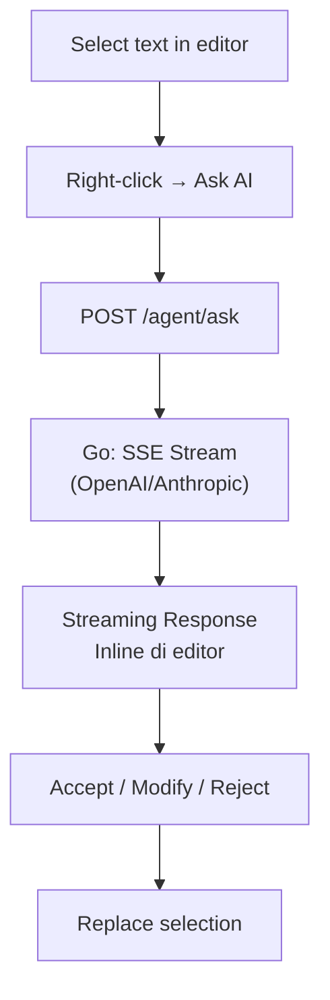

# User Flows — Editor

## Flow 1: Open Vault & Edit Note

```mermaid
flowchart TB
    A["Open Editor"] --> B["Welcome Screen"]
    B --> C["Open Folder (Picker)"]
    C --> D["Vault Loaded"]
    D --> E["File Tree (HTMX)\nGET /vault/tree"]
    E --> F["Click .md File"]
    F --> G["CodeMirror 6\nLoad Content"]
    G --> H["Edit Markdown"]
    H --> I["Preview Updates\n(React mdx-content)"]
    H --> J["Auto-save\n(debounce)"]
```

## Flow 2: Wiki Link Autocomplete

```mermaid
flowchart TB
    A["Type [["] --> B["Go Parser\nDetect [[ context"]
    B --> C["GET /wiki/suggest?q=..."]
    C --> D["Return matching notes"]
    D --> E["Popup di editor"]
    E --> F["Select → Insert ]]\nresolve path"]
```

## Flow 3: Git Push → Publish

```mermaid
flowchart TB
    A["Click 'Push to Publish'"] --> B{"docu.json exists?"}
    B -->|Yes| C["Git add ."]
    B -->|No| D["Not available\n(private vault)"]
    C --> E["Git commit\n(auto message)"]
    E --> F["Git push"]
    F --> G["CI Trigger\n(GitHub Actions)"]
    G --> H["Flame Build\n→ Static HTML"]
    H --> I["Deploy\n(Vercel/Netlify)"]
```

## Flow 4: Search

```mermaid
flowchart TB
    A["Click Search / CMD+F"] --> B["Search Bar Focus"]
    B --> C["Type Query"]
    C --> D["Debounce 300ms"]
    D --> E["Go: Bleve Search"]
    E --> F["Hasil: title + snippet"]
    F --> G["Click Result → Open Note"]
```

## Flow 5: AI Agent

```mermaid
flowchart TB
    A["Select text in editor"] --> B["Right-click → Ask AI"]
    B --> C["POST /agent/ask"]
    C --> D["Go: SSE Stream\n(OpenAI/Anthropic)"]
    D --> E["Streaming Response\nInline di editor"]
    E --> F["Accept / Modify / Reject"]
    F --> G["Replace selection"]
```
