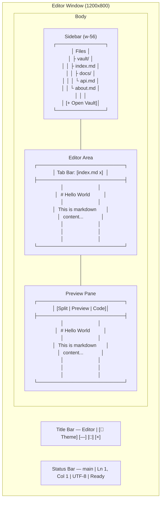
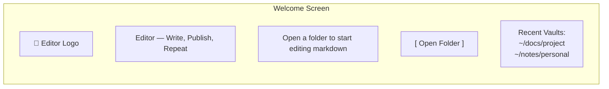
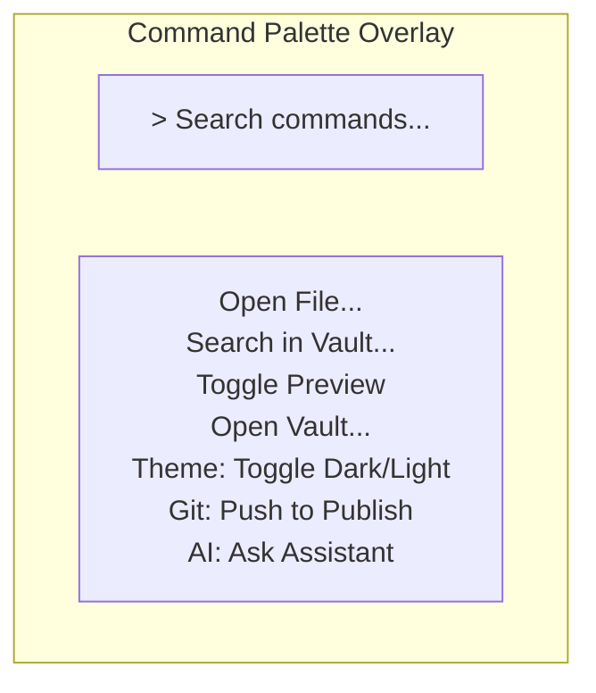

# Screen Wireframes — Editor

## Layout Utama (Zed-like)



## Welcome Screen (No Vault)



## Command Palette (Ctrl+P)



## Wikilink Autocomplete Popup

```mermaid
flowchart TB
    subgraph AC["Autocomplete Dropdown"]
        Q["[[docu"]]
        RESULTS["📄 documentasi-api\n📄 docu-json-config\n📄 dokumentasi-user\n+ Create 'docu...'"]
    end
```
