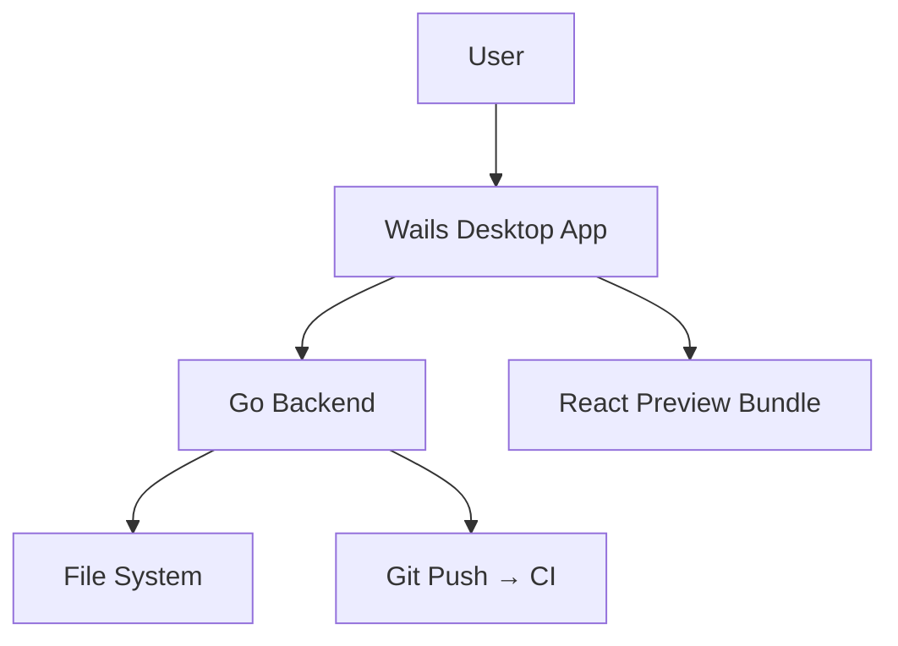
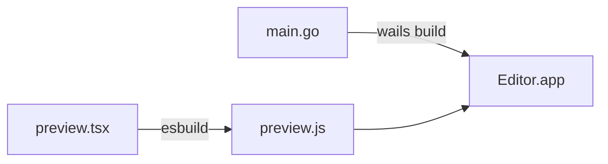

# Technical Design Document — Editor

## System Context

## Tech Stack
| Layer | Teknologi | Versi |
|-------|-----------|-------|
| Desktop | Wails v2 | 2.13.x |
| Backend | Go | 1.26 |
| Bundler | Vite | 8.x |
| Frontend | HTMX + Alpine.js | 2.x / 3.x |
| Editor | CodeMirror 6 | 6.x |
| Preview | React + @docubook/mdx-content | 19.x / 3.4.x |
| Preview Bundler | esbuild | 0.28.x |
| CSS | Custom (Zed theme) | — |
| Target | macOS 10+ (arm64 + x64) | — |

## Go Dependencies
| Package | Fungsi | Status |
|---------|--------|--------|
| chi | HTTP router | ✅ |
| goldmark | Markdown parser | ✅ |
| fsnotify | File watcher | ⏳ Sprint 7 |
| bleve | Full-text search | ⏳ Sprint 6 |

## Build Pipeline

