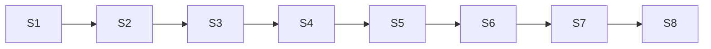

# Sprint Manifest — Editor

## Capacity Planning

| Sprint | Focus | Tasks | Est. Hours | Complexity |
|--------|-------|-------|------------|------------|
| Sprint 1 | Foundation — Wails init, Go backend, HTMX layout, CodeMirror | 6 | 15h | Medium |
| Sprint 2 | Preview — preview bundle, editor↔preview sync, split pane | 5 | 12h | Medium |
| Sprint 3 | Vault — CRUD file/folder, file tree HTMX, goldmark parser | 6 | 18h | High |
| Sprint 4 | Project — docu.json editor, git push, status bar | 4 | 10h | Medium |
| Sprint 5 | Wiki — wikilinks parser, autocomplete, backlinks panel | 5 | 16h | High |
| Sprint 6 | Tags + Search — #tag detection, bleve search, tag pane | 4 | 12h | High |
| Sprint 7 | Watch + Graph — fsnotify watcher, D3.js graph view | 4 | 14h | High |
| Sprint 8 | AI + Polish — AI agent SSE, installer, final polish | 5 | 16h | High |

**Total:** 39 tasks, ~113 hours

## Velocity Assumption

- **Developer:** 1 full-time (40h/week)
- **Sprint length:** 1 minggu
- **Available hours:** 25h/sprint (after meetings, reviews, buffer)
- **Estimated delivery:** 8 sprints = 8 minggu

## Milestone Mapping

| Milestone | Sprints | Deliverables |
|-----------|---------|--------------|
| **M1: Foundation** | Sprint 1-2 | Wails app + Go backend + editor + preview |
| **M2: Vault Core** | Sprint 3-4 | File tree CRUD, docu.json, git push |
| **M3: Editor Complete** | Sprint 5-6 | Wiki links, backlinks, tags, search |
| **M4: Polishing** | Sprint 7-8 | File watcher, graph, AI agent, installer |

## Dependency Chain

**Critical Path:** S1 → S2 → S3 → S4 → S5 → S6

S7 dan S8 bisa overlap dengan S5-S6 (paralel untuk fitur independen).

## Resource Allocation

| Role | Availability | Notes |
|------|-------------|-------|
| Go backend dev | Full-time | Semua sprint |
| Frontend dev | Full-time | Sprint 1-6 |
| UI designer | Part-time | Sprint 1 (tokens), 3 (vault UI) |
| QA | Part-time | Sprint 4+ |

## Definition of Done (per sprint)

- [ ] All acceptance criteria terpenuhi
- [ ] Edge cases tercover
- [ ] `wails build` sukses
- [ ] Manual test lulus (critical path)
- [ ] ADR diupdate jika ada keputusan baru
