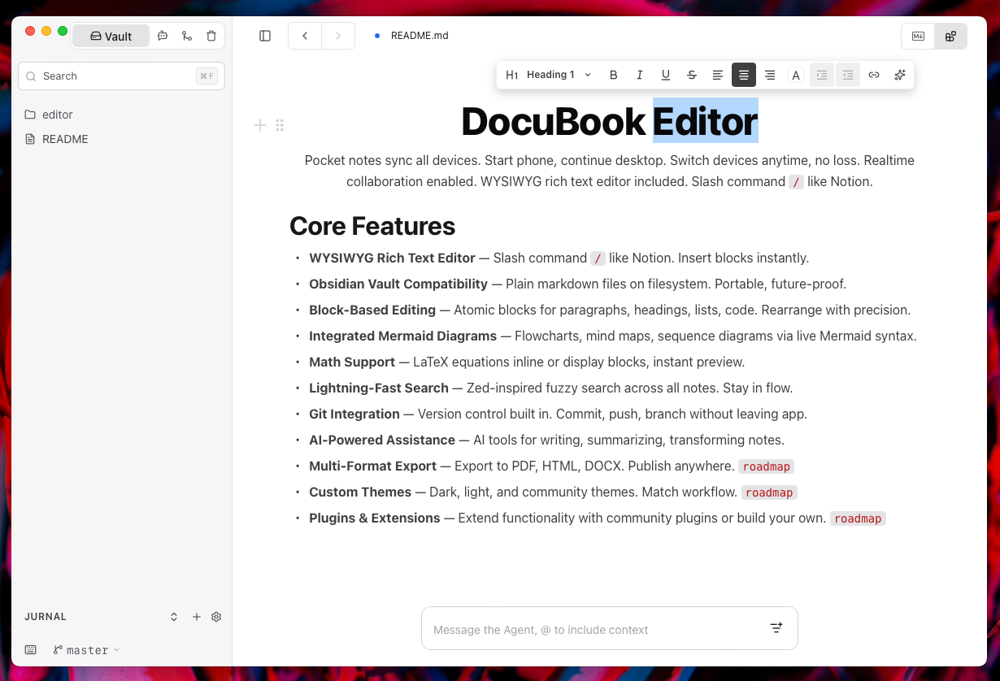

<p align="center">
  
</p>

<p align="center">
  <a href="https://github.com/DocuBook/editor/releases"></a>
  <a href="https://github.com/DocuBook/editor/actions"></a>
  <a href="https://github.com/DocuBook/editor/blob/master/LICENSE"></a>
</p>

> Pocket notes sync all devices. Start phone, continue desktop. Switch devices anytime, no loss. Realtime collaboration enabled. WYSIWYG rich text editor included. Slash command `/` like Notion.

## Install

### Web — Docker

```bash
docker run -d --name docubook -p 8080:8080 \
  -v docubook:/data \
  ghcr.io/docubook/editor
```

Open [http://localhost:8080](http://localhost:8080) and create the admin account. Setup cannot be skipped; set `DB_SETUP_TOKEN` before public exposure to protect account creation.

> [!IMPORTANT]
> Keep `/data` on a persistent volume. It contains vaults, configuration, and keys; recreating a container without this mount deletes them.

For production, pin an image tag, place the container behind HTTPS, set `DB_SECURE_COOKIE=1`, and back up `/data`.

| Variable                                                                          | Default      | Purpose                                                                 |
| --------------------------------------------------------------------------------- | ------------ | ----------------------------------------------------------------------- |
| `DB_SETUP_TOKEN`                                                                  | empty        | Protects first-run admin setup; generate with `openssl rand -hex 32`    |
| `DB_SECURE_COOKIE`                                                                | `false`      | Restricts session cookies to HTTPS when set to `1`                      |
| `DB_SESSION_TTL_HOURS`                                                            | `168`        | Session lifetime in hours                                               |
| `DB_KEYS_PASSPHRASE`                                                              | empty        | Encrypts `keys.json` at rest; losing it makes encrypted keys unreadable |
| `DB_ADMIN_EMAIL` + `DB_ADMIN_PASSWORD`                                            | unset        | Skips the setup wizard when both are set                                |
| `DB_OPENAI_COMPAT_BASE_URL`, `DB_OPENAI_COMPAT_API_KEY`, `DB_OPENAI_COMPAT_MODEL` | unset        | Provisions a custom OpenAI-compatible provider                          |
| `RUST_LOG`                                                                        | app defaults | Controls server log filtering                                           |

See [`.env.example`](./.env.example) for the complete list and deployment notes. Environment variables are read at startup.

```yaml
services:
  docubook:
    image: ghcr.io/docubook/editor
    ports:
      - "8080:8080"
    volumes:
      - docubook:/data
    restart: unless-stopped

volumes:
  docubook:
```

The image supports `linux/amd64` and `linux/arm64` and includes a health check at `/api/health`.

### Desktop — macOS

Download the appropriate DMG from [Releases](https://github.com/DocuBook/editor/releases):

| File                                    | Mac                                   |
| --------------------------------------- | ------------------------------------- |
| `DocuBook Editor_<version>_aarch64.dmg` | Apple Silicon                         |
| `DocuBook Editor_<version>_x64.dmg`     | Intel, or Apple Silicon via Rosetta 2 |

Builds are not signed or notarized yet; Apple Developer signing will be added when sponsorship covers it. You can [sponsor the project on GitHub](https://github.com/sponsors/gitfromwildan). If Gatekeeper blocks the first launch, run once:

```bash
xattr -cr /Applications/DocuBook\ Editor.app
open /Applications/DocuBook\ Editor.app
```

## Start Writing

1. Open, create, or clone a vault.
2. Select a `.md` or `.mdx` file.
3. Type `/` to insert blocks or use **Code** to edit raw Markdown.
4. Configure an AI provider in **Settings → AI** if needed.
5. Configure identity and a remote in **Settings → Git**, then **Save** and **Publish**.

Other text formats can be viewed but only `.md` and `.mdx` use the WYSIWYG editor.

## What You Get

- **Local vaults** — Work directly with folders and Markdown files without a proprietary format.
- **Block editing** — Headings, lists, quotes, code, math, diagrams, inline formatting, and raw Markdown mode.
- **Reviewable AI** — Write, improve, summarize, translate, and fix text; accept or reject every suggested change before it reaches the document.
- **Provider choice** — Built-in providers plus custom OpenAI-compatible endpoints, with keys stored backend-side.
- **Git publishing** — Stage, commit, push, and see the active branch from the editor.
- **Fast navigation** — File search, expandable folders, backlinks, and wikilinks.

## Shortcuts

| Shortcut                          | Action                        |
| --------------------------------- | ----------------------------- |
| `Ctrl/Cmd+J`                      | Toggle sidebar                |
| `Ctrl/Cmd+F` or `Ctrl/Cmd+P`      | Find a file                   |
| `Ctrl/Cmd+O`                      | Open a vault                  |
| `Ctrl/Cmd+Shift+E`                | Toggle WYSIWYG/Markdown       |
| `Ctrl/Cmd+Z` / `Ctrl/Cmd+Shift+Z` | Undo/redo                     |
| `Ctrl+Alt+L`                      | Open the AI menu              |
| `Ctrl/Cmd+,`                      | Open settings                 |
| `/`                               | Open the block menu           |
| `Tab` / `Shift+Tab`               | Indent/outdent a block        |
| `Ctrl/Cmd+B`, `I`, `U`, `K`       | Bold, italic, underline, link |

## Stack

| Layer    | Technology                          |
| -------- | ----------------------------------- |
| Desktop  | Tauri v2, Rust                      |
| Web API  | Axum, Rust                          |
| Frontend | React 19, TypeScript 7, Zustand     |
| Editor   | BlockNote 0.54, TipTap, ProseMirror |
| UI       | Tailwind CSS v4                     |
| Build    | Vite 8, Rolldown                    |

## Development

See [CONTRIBUTING.md](./CONTRIBUTING.md) for prerequisites, local development, builds, cross-compilation, and project structure.

Operational logs are written to stdout/stderr and can be filtered with `RUST_LOG`. DocuBook does not transmit frontend telemetry.

## Credits

DocuBook Editor isn't built from nothing — it stands on the shoulders of a few thoughtful open-source projects. Every note you open, every keystroke in the WYSIWYG canvas, flows through them:

- **[BlockNote](https://www.blocknotejs.org/)** — the block editor that powers the writing experience. The `/`-menu, math blocks, diagrams, and the block schema all live here. The editor you type into _is_ BlockNote.
- **[TipTap](https://tiptap.dev/)** — the headless editor framework underneath. It handles the plumbing — extensions, keyboard shortcuts, undo/redo, editor lifecycle — so BlockNote and you can focus on ideas instead of boilerplate.
- **[ProseMirror](https://prosemirror.net/)** — the engine at the foundation. It's the document model and collaborative-editing core that both TipTap and BlockNote are built on, and the reason your undo history and document state behave so predictably.

These aren't dependencies we take for granted — they're years of patient work done by people who genuinely care about good tools. If DocuBook has made your notes, research, or docs a little better, consider giving a little back so the ecosystem keeps thriving:

- **ProseMirror** · [marijnhaverbeke.nl/fund](https://marijnhaverbeke.nl/fund/) — by Marijn Haverbeke
- **TipTap** · [github.com/sponsors/ueberdosis](https://github.com/sponsors/ueberdosis)
- **BlockNote** · [github.com/sponsors/YousefED](https://github.com/sponsors/YousefED)

And if DocuBook itself has earned a place in your workflow — every star, thoughtful issue, and contribution makes a real difference, and so does [sponsoring the author on GitHub](https://github.com/sponsors/gitfromwildan). It helps keep development moving forward, feature by feature, and lets us keep this project free and open for everyone.

Whatever you choose, thank you for reading this far — and welcome to the neighborhood. ❤️

---

## License

[AGPL-3.0](./LICENSE) — DocuBook Editor is released under GNU Affero General Public License version 3. Source and network-use obligations follow `LICENSE`.

Copyright (C) 2026 @gitfromwildan [email@wildan.dev](mailto:email@wildan.dev).

### Commercial Use

**AGPL-3.0 permits commercial use** — you may sell the app, host it as a service, or use it internally, as long as you comply with AGPL source and network-use obligations in `LICENSE`.

That network-use obligation is exactly why this project is AGPL-3.0 and not MIT: if you distribute or host a **modified** version, that version's source must stay AGPL-3.0. So commercial use has two honest paths:

1. **Publish** — comply with `LICENSE`. If you modify DocuBook Editor and let users interact with it over a network, offer them the modified version's source under AGPL-3.0. No fee, no permission needed.
2. **Cooperate** — keep your changes closed under a separate commercial arrangement with the author. This is where a **royalty can be agreed**.

The royalty is not a GPL requirement and does not restrict what the license already permits — it is what the author asks for explicitly on the second path. It is reasonable for the same reason AGPL exists: the network case is where a product captures value from this code without contributing anything back. Two cases where it is expected rather than exceptional:

- **Hosted or managed service** — offering DocuBook Editor as a paid SaaS, or as a managed instance for third parties.
- **AI gateway or provider** — selling or metering model access through it, or running an AI gateway/provider product on top of it.

Complying with `LICENSE` is sufficient on its own. Nothing in this README adds a condition to, or restricts, the rights AGPL-3.0 grants.

> If you would like to work with the author directly — for example, running DocuBook Editor as a dedicated managed service or building an AI gateway/provider on top of it — reach out to arrange cooperation: [email@wildan.dev](mailto:email@wildan.dev)

> [!NOTE]
> **Personal and community use remains free forever.** Using DocuBook Editor for yourself, your studies, or your community — on your own devices or your own server — always stays free and open source. Where a commercial arrangement is chosen, a royalty can be agreed; it never touches personal or community use.
